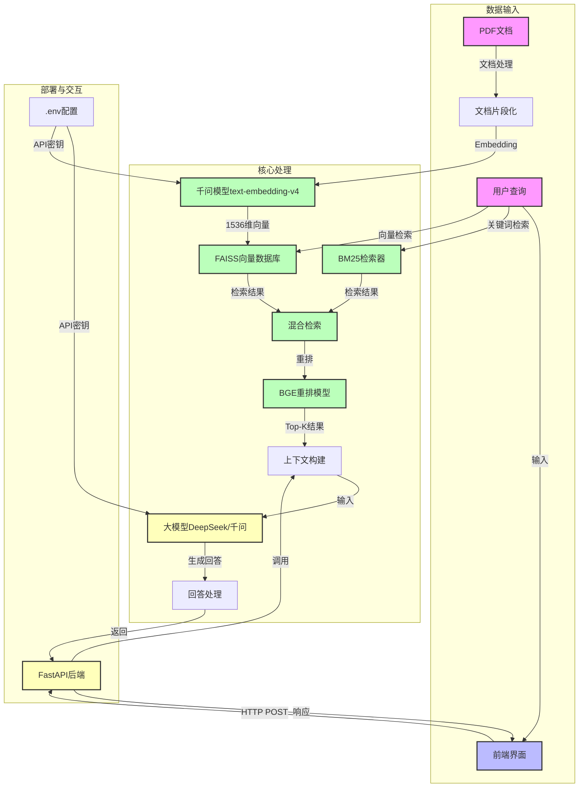

<div align="center">
  
  <h1>电力设备监控智能问答系统</h1>
</div>

## 项目简介

基于RAG架构的智能助手，专为电力设备监控领域设计，集成国产大模型、混合检索和多轮对话能力。

## 核心特色
- 混合检索引擎（BM25 + FAISS + BGE重排）
- 支持千问、DeepSeek等国产大模型
- 使用千问模型作为embedding模型
- 电力设备专用工具集
- 多轮对话能力
- 专业领域知识覆盖

## 千问模型Embedding参考代码
```python
import os
from openai import OpenAI

input_text = "衣服的质量杠杠的"

client = OpenAI(
    # 若没有配置环境变量，请用阿里云百炼API Key将下行替换为：api_key="sk-xxx",
    # 各地域的API Key不同。获取API Key：`https://help.aliyun.com/zh/model-studio/get-api-key`
    api_key=os.getenv("DASHSCOPE_API_KEY"),  
    # 以下是北京地域base-url，如果使用新加坡地域的模型，需要将base_url替换为：`https://dashscope-intl.aliyuncs.com/compatible-mode/v1`
    base_url="`https://dashscope.aliyuncs.com/compatible-mode/v1`"
)

completion = client.embeddings.create(
    model="text-embedding-v4",
    input=input_text
)

print(completion.model_dump_json())
```

## 技术实现

### 系统架构流程图



### 核心技术组件

#### Embedding实现
- **模型**：千问模型（text-embedding-v4）
- **API**：OpenAI兼容接口（阿里云百炼）
- **向量维度**：1536维
- **存储**：FAISS向量数据库

#### 前后端技术
- **后端**：FastAPI框架
- **前端**：HTML5 + CSS3 + JavaScript
- **Markdown解析**：marked.js
- **通信**：HTTP POST请求
- **CORS**：跨域资源共享配置

#### RAG增强检索
- **混合检索**：BM25 + FAISS向量检索
- **重排**：BGE模型
- **上下文管理**：多轮对话记忆

#### 部署方案
- **启动脚本**：start.sh（Linux/Mac）、start.bat（Windows）
- **依赖管理**：requirements.txt
- **环境配置**：.env文件
- **服务端口**：后端8000，前端3000

## 快速开始

### 1. 安装依赖
```bash
pip install -r requirements.txt
```

### 2. 配置API密钥
1. 复制 `.env.example` 文件并重命名为 `.env`
2. 编辑 `.env` 文件，填入API密钥：
```
OPENAI_API_KEY=your_deepseek_api_key
OPENAI_API_BASE=https://api.deepseek.com/v1
DASHSCOPE_API_KEY=your_qianwen_api_key
```

### 3. 运行系统
- **推荐**：使用启动脚本
  - Linux/Mac：`./start.sh`
  - Windows：`start.bat`
- **手动运行**：
  1. 首次运行：`python main.py`（构建向量数据库）
  2. 后端服务：`python app.py`
  3. 前端服务：`python -m http.server 3000`

## 访问地址
- 后端服务：http://localhost:8000
- API文档：http://localhost:8000/docs
- 前端界面：http://localhost:3000

## 故障排除
- 端口占用：停止占用端口的进程
- API密钥：确保在 `.env` 文件中正确配置
- 向量数据库：确保PDF文档存在且格式正确
- 前端连接：检查后端服务是否正常运行


